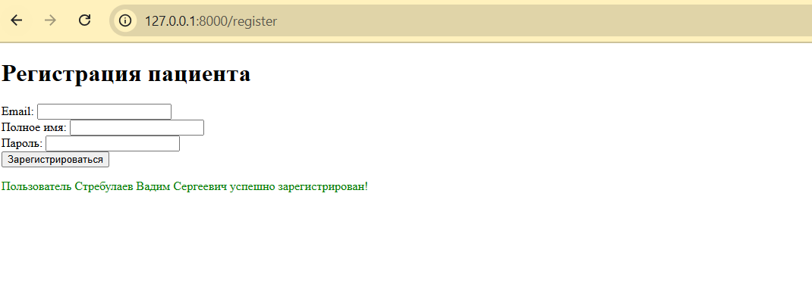

# Структура файлов
```
├── README.md
├── backend
│ ├── Dockerfile
│ ├── app
│ │ ├── init.py
│ │ ├── pycache/
│ │ ├── auth.py
│ │ ├── database.py
│ │ ├── dependencies.py
│ │ ├── main.py
│ │ ├── models.py
│ │ ├── routes
│ │ │ ├── init.py
│ │ │ ├── pycache/
│ │ │ ├── appointments.py
│ │ │ ├── doctors.py
│ │ │ ├── patients.py
│ │ │ ├── schedule.py
│ │ │ └── users.py
│ │ ├── schemas.py
│ │ ├── static
│ │ │ └── style.css
│ │ ├── templates
│ │ │ ├── index.html
│ │ │ ├── login.html
│ │ │ ├── patient_appointments.html
│ │ └ └── register.html
│ └── requirements.txt
└── docker-compose.yml
```
---

## Комментарии по файлам и папкам

### Корень проекта

- **README.md**  
  Документация проекта — описание, инструкции по запуску и т.п.

- **docker-compose.yml**  
  Конфигурация для запуска контейнеров Docker (backend, БД и др.).

---

### Папка `backend`

- **Dockerfile**  
  Описание образа Docker для backend-приложения.

- **requirements.txt**  
  Список Python-зависимостей проекта.

---

### Папка `app`

- **`__init__.py`**  
  Позволяет Python трактовать папку как пакет. (Для других файлов)

- **`__pycache__/`**  
  Кэш скомпилированных Python-файлов (pyc).

- **auth.py**  
  Логика аутентификации, генерация и проверка токенов.

- **database.py**  
  Настройка подключения к базе данных.

- **dependencies.py**  
  Общие зависимости и вспомогательные функции для FastAPI.

- **main.py**  
  Точка входа приложения — создание и запуск FastAPI.

- **models.py**  
  Описания моделей базы данных (ORM).

- **schemas.py**  
  Pydantic-схемы для валидации и сериализации данных.


---

### Папка `routes`

- **`__init__.py`**  
  Пакет маршрутов (роутов).

- **`__pycache__/`**  
  Кэш скомпилированных Python-файлов.

- **appointments.py**  
  Маршруты для работы с приёмами пациентов.

- **doctors.py**  
  Маршруты для работы с данными врачей.

- **patients.py**  
  Маршруты для работы с пациентами.

- **schedule.py**  
  Маршруты для расписаний приёмов.

- **users.py**  
  Маршруты для работы с пользователями (регистрация, профиль).

---

### Папка `static`

- **style.css**  
  Стили для фронтенд-страниц. (Сейчас не используется)

---

### Папка `templates`

- **index.html**  
  Главная страница приложения.

- **login.html**  
  Страница логина.

- **register.html**  
  Страница регистрации.

- **patient_appointments.html**  
  Страница с расписанием и приёмами пациента.

---

## Текущий этап разработки

- Реализованы страницы **логина** и **регистрации**.
Вход:

Регистрация:

- При логине в ответ приходит **access token**, но сессия пока не сохраняется — требуется реализовать полноценное управление сессиями (cookies или token storage).
- Далее планируется доработка механизма сессий и расширение функционала.

---
